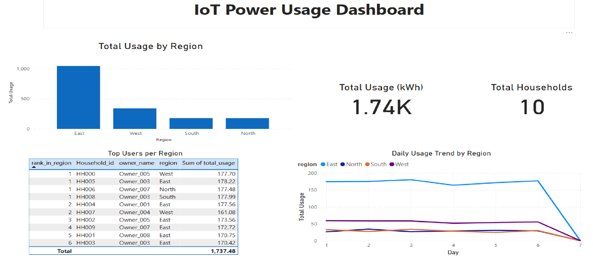

# IoT Power Usage Analyzer

A complete data engineering project to simulate, process, and visualize household electricity usage using PySpark, AWS, and Power BI.

---

## Tech Stack
- **Data Simulation & ETL**: Python, NumPy, Pandas, PySpark
- **Cloud Storage & Processing**: AWS S3, AWS Athena, AWS Glue
- **Visualization**: Power BI Desktop

---

## Project Structure
- `data/raw/`: Simulated source CSVs
- `data/processed/`: Cleaned and aggregated output files used by Athena
- `notebooks/`: Jupyter notebook to simulate and transform data using PySpark
- `athena_sql/`: SQL scripts to create external & parquet tables in Athena
- `powerbi_dashboard/`: Power BI `.pbix` file for analysis
- `screenshots/`: Dashboard visuals for quick preview

---

## Dashboard Highlights
- KPI Cards : Total Usage (kWh) and Total Households
- Bar Chart : Usage by Region
- Line Chart: Daily Usage Trends
- Table     : Top Users by Region

---

## Setup Instructions
1. Upload `data/processed/` files to an S3 bucket (e.g., `iot-usage-analyzer/processed/`)
2. Use `athena_sql/create_external_tables.sql` to create Athena tables
4. Open the Power BI `.pbix` file and connect to your Athena DSN

---

## Use Case
Designed to mimic a real-world IoT power usage scenario for smart grids or utility companies, showcasing end-to-end data engineering skills from simulation to business insights.

---

## Author
Built by Vasudha Tanniru | Aspiring Data Engineer

